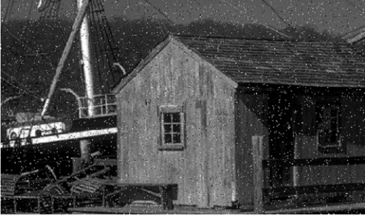

# Image Filters

#### We have many image with different extension like jpg and png and the user do many modification on the images like zooming, change the extension and other and that lead to produce some of noise in the image like blur(left image) and some of dotes in the image(right image). 

 

#### To remove any kind of noise in the images we must use filtering. we have many of filters and each filter is the best solution for specific noise like median filter for salt and paper noise like the below figure.

 

#### The some modifications that I can applied is to make image 2D by make image gray and we have many ways to applied via the green or red or blue color and we can see the difference via the below figures .the first one for the original image, second one for blue, third one for green and the last one for red.

 

#### I take image and I make it gray via the green color then I applied Median Blurring filter in image has noise. the first image the original image, second image after gray color and the last one after the filter.

